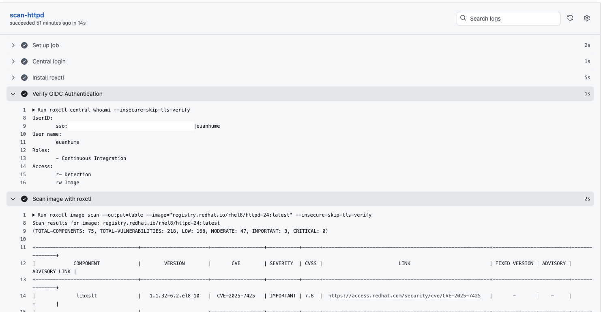
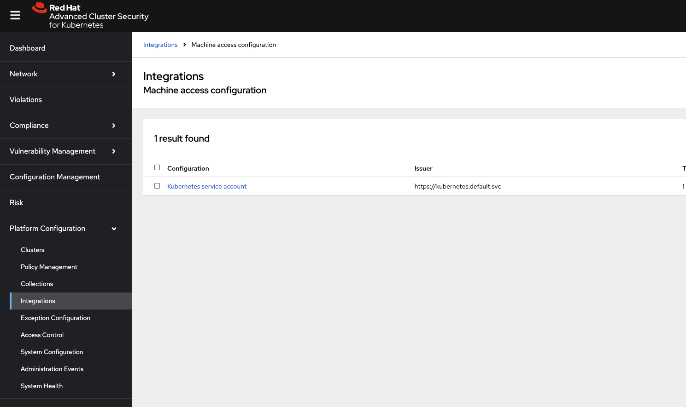
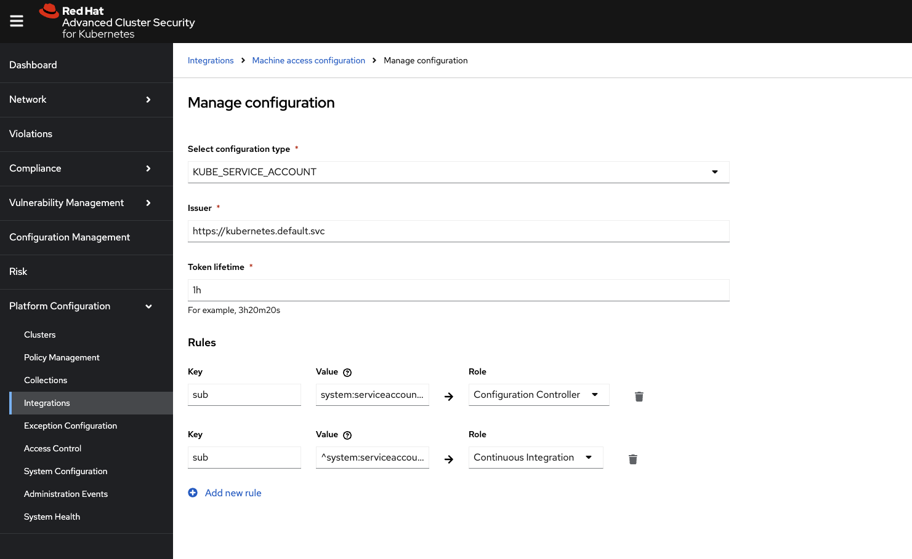
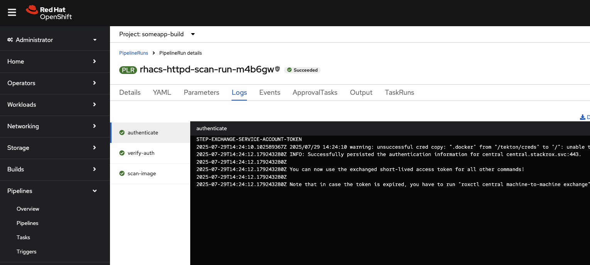
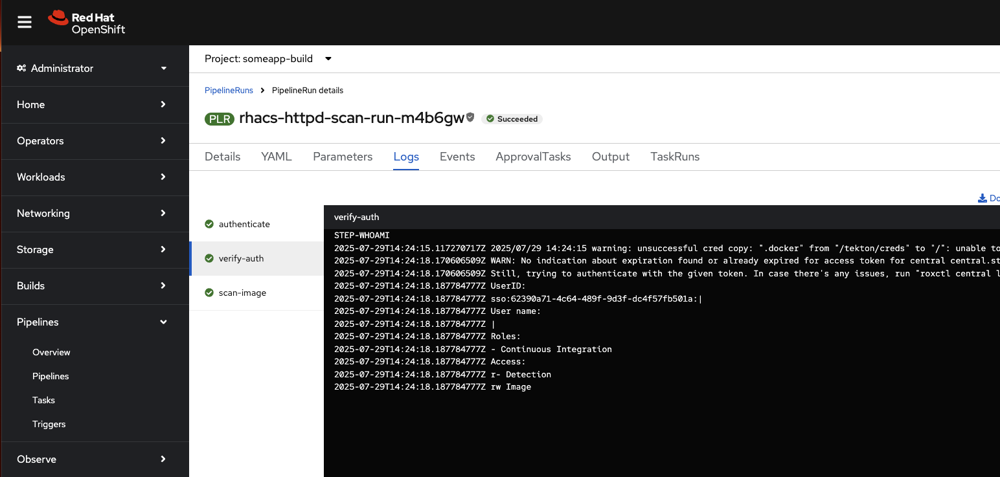
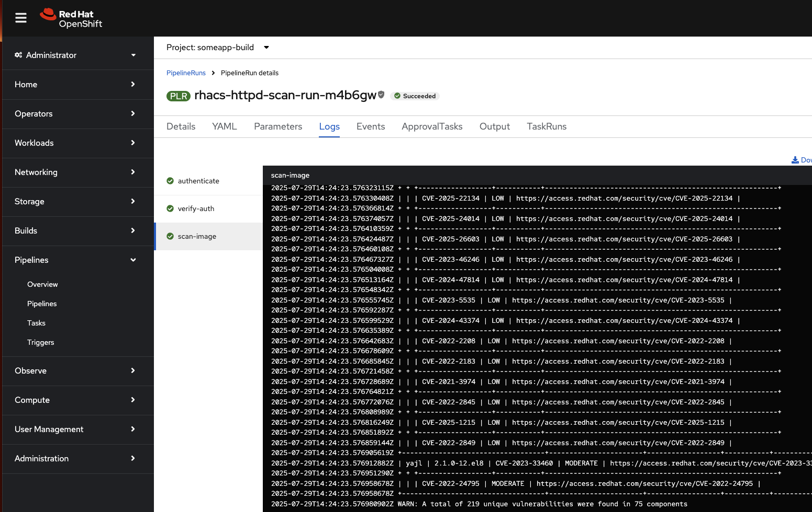

# roxctl-playground

This repository demonstrates how to use OIDC authentication with Red Hat Advanced Cluster Security (RHACS) in CI/CD pipelines, eliminating the need for long-lived API tokens. The image below shows the required machine access configuration on the ACS side.

## GitHub Actions

The GitHub Actions workflow authenticates with a RHACS instance using OIDC and performs a security scan of the `registry.redhat.io/rhel8/httpd-24:latest` container image. 

The required configuration is required on RHACS.


The image below shows a successful workflow run authenticating with RHACS using OIDC and displaying the container image scan results:



## Tekton

The Tekton pipeline authenticates with a RHACS instance using the service account's JWT token for OIDC authentication and performs a security scan of the `registry.redhat.io/rhel8/httpd-24:latest` container image. 

As of RHACS 4.8, there is a default **Machine access configuration** called `Kubernetes service account`. This is what we will use for Tekton.



Edit this **Machine access configuration** and add an additional `sub`. In my example, I am using a regex to allow any service account named `pipeline` in any namespace that is suffixed with `-build` i.e. `^system:serviceaccount:.*-build:pipeline$`.



The following tasks are required for the pipeline. Install the catalog tasks, create the workspace, deploy the pipeline, and run it:

```
oc apply -f https://api.hub.tekton.dev/v1/resource/tekton/task/rhacs-m2m-authenticate/0.1/raw
oc apply -f https://api.hub.tekton.dev/v1/resource/tekton/task/rhacs-image-scan/4.0/raw
oc apply -f .tekton/pvc.yaml
oc apply -f .tekton/pipeline.yaml
oc apply -f .tekton/pipelinerun.yaml
```

The images below show a successful pipeline run authenticating with RHACS using OIDC and displaying the container image scan results:





References:

- [Install roxctl - Authenticate with short-lived access tokens](https://github.com/marketplace/actions/install-roxctl#authenticate-with-short-lived-access-tokens)
- [Red Hat ACS Documentation - Configure short-lived access](https://docs.redhat.com/en/documentation/red_hat_advanced_cluster_security_for_kubernetes/4.8/html-single/operating/index#configure-short-lived-access)
- [Red Hat Advanced Cluster Security Machine to machine authentication Task](https://artifacthub.io/packages/tekton-task/tekton-catalog-tasks/rhacs-m2m-authenticate)
- [Red Hat Advanced Cluster Security Image Scan Task](https://artifacthub.io/packages/tekton-task/tekton-catalog-tasks/rhacs-image-scan)