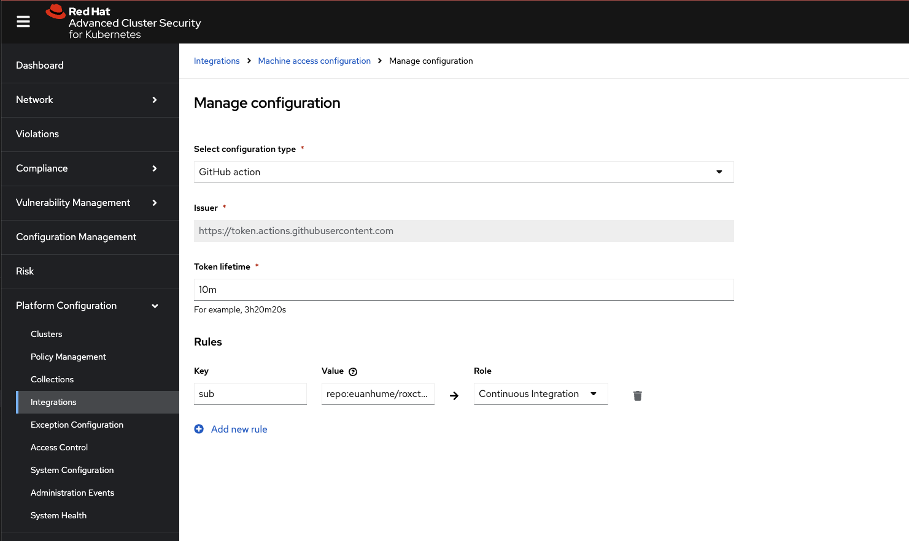

# roxctl-playground

This repository demonstrates how to use OIDC authentication with Red Hat Advanced Cluster Security (RHACS) in GitHub Actions, eliminating the need for long-lived API tokens. The image below shows the required machine access configuration on the ACS side.

References:

- [Install roxctl - Authenticate with short-lived access tokens](https://github.com/marketplace/actions/install-roxctl#authenticate-with-short-lived-access-tokens)
- [Red Hat ACS Documentation - Configure short-lived access](https://docs.redhat.com/en/documentation/red_hat_advanced_cluster_security_for_kubernetes/4.8/html-single/operating/index#configure-short-lived-access)